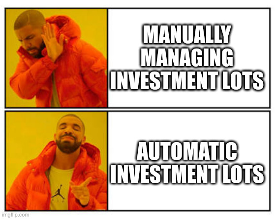

# Hledger-lots



This package helps [hledger](https://hledger.org/) users to add and manage transactions involving buying and selling commodities like stock, currency, etc.

## Features

### Add transaction

Instead of editing the journal file directly to add a commodity purchase or sale, answer some interactive prompts with the following benefits:

- Validation of allowed values for each field
- Fuzzy search completion using previous transaction data in the journal
- Select the answer between possible values or autocomplete when only one answer is allowed.

### Automatic Lots

The most convoluted aspect of using hledger for investment is to [manage lots](https://hledger.org/track-investments.html) because when selling a commodity, you need to use its cost, which is buried deep down in your journal, instead of the sale price, which is more easily available to add the correct profit/loss of the trade.

To calculate the cost, there are some methods you can apply and hledger doesn't provide tools to do it, so you are on your own. Hledger-lots calculate the cost without the need to alocate each purchase to a specific subaccount or tag. When you use `hledger-lots sell`, it traverse the journal and arrive to the correct cost without additional information.

You can choose between two diferrent methods to calculate the cost of selling lots:

- **FIFO**: First In First Out
- **AVERAGE COST**: Average Cost of all previous purchase. It is as if selling a proportional part of each previous sale.


### Automatic Price Download

One simple command to automatically download market price from [Yahoo Finance](https://finance.yahoo.com/) for choosen commodities as explained [here](market_prices/). 

### Reports

To get information about the commodities, there is more 2 commands:

| command                          | description                                          |
|----------------------------------|------------------------------------------------------|
| [view](usage/#hledger-lots-view) | Get the lots and indicators for a specific commodity |
| [list](usage/#hledger-lots-list) | Get the indicators for all commodities as a table    |

The indicators provided by these command are explained [here](#indicators).

## Documentation

Documentation with usage information can be found [here](https://edkedk99.github.io/hledger-lots/)


## Installation

### Requirements

- [python](https://www.python.org/)
- [hledger](https://hledger.org/1.29/hledger.html#p-directive)

### Command

```python
pip install --upgrade hledger-lots
```

## Workflow

1. Add purchase using the command [buy](usage/#hledger-lots-buy) or edit the journal as usual using "@" notation. **Don't bother creating subaccounts or tags with unique lot name**. See the some examples [here](examples/data.journal)
2. Download market price history as [price directive](https://hledger.org/1.29/hledger.html#p-directive) using the command [prices](usage/#hledger-lots-prices)
3. View financial indicators for a specific commodity using [view](usage/#hledger-lots-view) or a summary of all commodities using [list](usage/$list). Optionally update market prices from [Yahoo Finance](https://finance.yahoo.com/) using the flag *--apend-prices-to [file path]*
4. When you sell, use the command [sell](usage/#hledger-lots-sell) instead of adding the transactions manually. Hledger-lots will generate the correct transaction and append to the selected journal if you confirm the transaction is correct. *See transaction tags with interesting indicators about the current trade*

> By default the sale is created using *FIFO* method. Use the option flag "--avg-cost" to change it to *Average Cost*


## Indicators
  
### Basic Indicators

- Commodity Name
- Total Quantity Purchased
- Total Amount Purchased
- Average Cost

### Market Indicators

For commodities with price directives on a date after the last purchase, you will have also the following indicators:

- Last Market Price
- Market Amount: Quantitty Purchased * Last Market Price
- Market Profit: Market Amount - Amount Purchased
- Last Market Date
- [XIRR](#xirr)

## XIRR

The sale transaction gives you the calculated **xirr** as tag, which is the internal rate of return of an investment based on a specified series of irregularly spaced cash flows. This value is annual percentage rate following the 30/360US day count convention. It is a good metric to compare the investment return with a benchmark like the S&P or the T-Bill, for example.

> Note the benchmark can use another day count convention, so this comparison may not be 100% precise. This app may in the future offer others day count convention for **xirr** calculation.

## Checks

It is recommended to use the option *--check* to ensure you past selling transaction has the correct cost according to the choosen cost method. It can be enabled by setting the environment variable **HLEDGER_LOTS_CHECK** to "true". It can be disabled with the option *--no-check* or setting the environment variable **HLEDGER_LOTS_CHECK** to "false".

> At the moment the default is set to "false", but expect it to be turned to "true" in future releases.

## Limitations

- No _short-selling_
- Each commodity can have only one base currency. For example, it is not possible to buy AAPL with USD and later with EUR.
